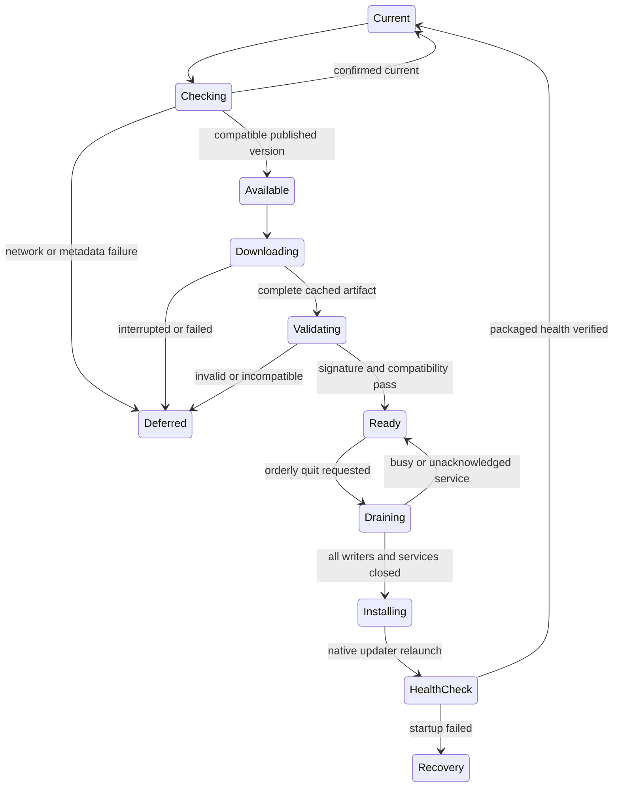

# Rieke OS Electron production specification

Status: implementation specification, 2026-09-29. Electron is the selected
desktop direction following the user's preference. This specification replaces
the AppKit/Sparkle proposal in the [earlier installer plan](one-click-installer.md).
The [GitHub comparison](../dev/GITHUB_DESKTOP_UPDATE_PATTERNS.md) remains useful
evidence about distribution mechanisms. No desktop installer is certified by
this document.

## Product contract

Users install a complete app from Rieke-OS GitHub Releases and open its icon.
The existing React interface runs in an Electron window. All required Python,
parser utilities, database executables and frontend assets are bundled. First
launch and ordinary use require no dependency downloads, Terminal, system Python,
Node, Git, compiler, Homebrew, Docker, or MATLAB. Original recordings and projects
are kept outside the app and are never part of an application update.

New versions are checked automatically, downloaded quietly and shown through
Release / Publish as Update or Ready. Installation waits for an orderly app quit;
the next normal launch uses the prepared version. Closing a window, an OS exit
event or an updater callback is not proof that scientific workers have stopped.
Imports and other writes must finish or explicitly cancel through their existing
transaction contracts before application replacement.

First advertised platform: macOS Apple Silicon. Electron's cross-platform shell
does not remove backend POSIX locks/process behavior or provide an Intel/Windows
MySQL build. Support for other platforms remains a separate qualification gate.
The minimum macOS version must be determined from the complete dependency closure
and tested before release, rather than copied from Electron's minimum alone.

Initial macOS delivery is a signed/notarized DMG containing the complete app and
the ZIP required by the updater. To retain the requested Install and Open action,
implement a first-open bootstrap mode before starting Python or any project.
That mode copies this exact complete signed app to a fixed user-owned location
such as `~/Applications/Rieke OS.app`, verifies the copied bundle, and launches
the installed copy. It must preserve permissions, symlinks and signatures, handle
an existing installation safely, and not overwrite a running app. Normal download
and macOS first-open prompts still apply. This install action remains E06 work;
electron-builder's DMG creation alone does not implement it.

## Intended infrastructure

| Component | Intended responsibility | Current gap |
| --- | --- | --- |
| Rieke-OS public repository | Canonical reviewed application baseline, release tags, documentation and version history | New development behavior lives in a separate dirty epicTreeGUI checkout. Reconcile deliberately. |
| GitHub Actions | Build dependencies and frontend, run tests, assemble platform artifacts, sign/notarize, qualify and publish | Public CI currently verifies source installation; no desktop pipeline exists. |
| Electron main process | Own application lifetime, launch authenticated local services, open project windows, track readiness, drain services and own updater | Not implemented. |
| Sandboxed React renderer | Existing scientific UI, draft persistence and visible update status | Current UI is a browser app; desktop bridge/navigation/download behavior needs integration. |
| Private Python runtime | Flask application served through a production WSGI server, pinned parser/wheels and compiled utilities | Existing venv and editable parser have absolute development paths. |
| Private MySQL runtime | Server/client/dump tools and complete native library/plugin closure; one database per project | Source provisioning rewrites binaries on the destination. Relocation must move into the build. |
| electron-builder | Platform installer, macOS DMG and ZIP update artifact, complete resource inclusion and update metadata | No desktop package/configuration or packaged runtime manifest yet. |
| electron-updater | Sole desktop download/install authority, configured for the public Rieke-OS GitHub provider | Source updater must be disabled for desktop installations. |
| GitHub Releases | Serve versioned installer/ZIP assets, blockmaps where generated and latest-mac.yml | Existing v0.1.2 assets are source ZIP and checksums. No separate feed service is required for this provider. |
| Signing infrastructure | Developer ID identity/private key, notarization authentication and temporary signing keychain in CI | Account ownership and protected secret configuration remain required. |
| Local user state | Preferences, service registry, diagnostics, update cache and recovery records | Must be separated from immutable application resources. |

The desktop app must specify the GitHub owner/repository explicitly. Never ship
an Actions token, signing key or private-repository credential in the client.
Public users require no GitHub login. The RSA source manager and Sparkle appcast
are not the selected desktop protocol; electron-builder/electron-updater metadata
and macOS code-signature verification are the selected path.
[Provider contract](https://www.electron.build/docs/features/auto-update/).

Registry versions observed on 2026-09-29 were Electron 44.5.0, electron-builder
26.15.3 and electron-updater 6.8.9. These are candidates for an exact lockfile,
not installed dependencies or compatibility-tested pins. Do not implement APIs
from newer documentation without checking the chosen package source. For example,
the documented v7 autoInstallEvent/onNextLaunch feature must not be assumed in
6.8.9 or treated as macOS behavior.

## Resource and data ownership

| Location | Contents and rules |
| --- | --- |
| Signed app resources | Electron main/preload, built React, standalone Python, installed dependency/parser wheels, native MySQL libraries, licenses and runtime manifest. Read-only after signing. |
| Electron userData directory | Preferences, validated process registry, app-instance identity and startup/recovery receipts. Do not store scientific catalog contents here. |
| User cache and log directories | Disposable runtime caches and bounded, redacted diagnostics; Python bytecode is disabled or redirected outside the signed app. |
| User-selected project folder | SQL data, project credentials, catalogs, H5 source references, saved queries, annotations, masks and exports. Update operations do not alter these. |

Executables belong in electron-builder extraResources, outside ASAR. Resolve them
from process.resourcesPath, never PATH, the working directory, an editable source
checkout, or an external uv installation. The runtime manifest records app/build
version, source/parser commits, platform/architecture, Python/MySQL versions,
workspace/database compatibility and packaged resource hashes. The manifest is
covered by the signed app; an untrusted metadata file alone cannot authorize
execution or a project migration.

Parser configuration must support a user-state location. Its current generated
config.ini inside the source package and bootstrap origin probe must be adapted
for installed wheels. Preserve parser semantics and run source-fidelity checks
after that change. Build native binaries and finish dependency-path rewrites
before signing; no first-launch pip/conda setup or ad-hoc re-signing is allowed.

## Reliability requirements and acceptance evidence

These are release requirements, not claims about present behavior.

| ID | Required invariant | Evidence that closes it |
| --- | --- | --- |
| R01 | Project ownership, original H5 identity/checksums and scientific state survive installation and updates. | Real import/tag/query/export/restart and source-user migration comparisons before/after. |
| R02 | The artifact is self-contained and relocatable, with no operational reference to build-user directories or external dependencies. | Offline install/use under another standard user and path; packaged import and native dependency audit. |
| R03 | Startup exposes the scientific UI only after the exact owned app/service versions are ready. | Wrong version, occupied port, failed import and duplicate-launch fault tests. |
| R04 | Exactly one process owns desktop installation; renderers and Python APIs cannot independently install or restart code. | IPC/API authorization tests and a concurrent two-window update test. |
| R05 | Active writers are never killed to install an update. | Imports, inbox ingestion, transfers and exports hold the update pending; every owned service acknowledges drain/exit. |
| R06 | Network, metadata, signature, platform, interrupted-download and disk failures leave the current app usable. | Fault injection against real packaged update clients, including restart after interruption. |
| R07 | The signed bundle is unchanged after launch, import, export and shutdown. | Signature verification and resource hashes before/after on downloaded artifacts. |
| R08 | Incompatible workspace/database/MySQL formats never silently activate or downgrade. | Reject incompatible packaged candidates before installation; separately validate any future migration. |
| R09 | A failed new backend/renderer startup reaches a recovery UI before opening or modifying projects. | Deliberately broken new-version health test and recovery using the last compatible signed artifact. |
| R10 | Release promotion never points clients at partial, missing, mismatched or older assets. | Multi-job publication/retry/race tests and verification of final public URLs/hashes. |
| R11 | Renderer content has no general filesystem, shell, process or updater authority. | Isolation/sandbox/CSP/navigation/IPC tests against malformed messages and foreign frames. |
| R12 | Diagnostics support recovery without leaking credentials or scientific recordings into release artifacts. | Logs/receipt redaction, packaging inventory and reproducible failure reports. |

Normal startup has a bounded readiness deadline with explicit failure information;
choose the production timeout from measured cold/warm launches on the supported
hardware. Backend request draining currently has a 30-second deadline. Reaching
any drain deadline defers replacement and keeps recovery controls available; it
does not authorize force-killing a writer. A process crash and OS shutdown need
their own recovery tests, since Electron quit hooks are not universal shutdown
acknowledgements.

## Desktop service and renderer boundary

Electron starts only its bundled interpreter and registered application entry
points, passing private session identity and user-state paths. Python binds
loopback only, with host/origin checks and a per-launch capability for desktop
control. Credentials and capabilities are not sent to external pages or logs.
Validate process records by PID plus executable/release, project identity and
physical path; PID existence alone is insufficient after a crash or PID reuse.

Initial integration may load the owned loopback UI to retain existing same-origin
API behavior. Before release, test server impersonation and desktop capability
handling; localhost is not an authentication mechanism. Use contextIsolation,
renderer sandboxing and nodeIntegration disabled, restrictive CSP, blocked
arbitrary navigation/popups and narrowly validated IPC. Open approved HTTPS
release notes externally with no privileged bridge. File chooser/download
integration must preserve the existing project path validation.
[Electron security requirements](https://www.electronjs.org/docs/latest/tutorial/security).

The preload bridge exposes typed operations and serialized status, not raw
ipcRenderer, arbitrary URLs, shell commands or filesystem paths for execution.
Validate sender window/frame and payload on every privileged operation.
Draft persistence is acknowledged before orderly closure. A renderer crash must
not imply permission to kill its backend or discard a job.

## Update state machine

The main process publishes these states to all windows. Status survives normal
restart where appropriate, and failed refresh does not erase a verified pending
update. Configure automatic downloads and an hourly check with jitter; do not
call a system-notification convenience API. A manual check remains available.
Retries are bounded and distinguish transient failures from rejected artifacts.

For the candidate electron-updater 6.8.9, explicitly set autoInstallOnAppQuit=false
and leave downgrade/prerelease selection disabled for stable clients. Only our
coordinator may call quitAndInstall, after package validation and all drain
acknowledgements. Native Squirrel.Mac staging can occur later than the library's
downloaded event; the Ready badge must not imply a signature/health guarantee
that has not been established. Implement a candidate-validation step with exact
expected app identity, platform, version and compatibility, and qualify it using
the pinned updater's actual macOS behavior.
[Pinned updater control](https://github.com/electron-userland/electron-builder/blob/electron-updater%406.8.9/packages/electron-updater/src/MacUpdater.ts).

Do not call quitAndInstall first and rely on before-quit to save drafts: Electron
documents that this path closes windows before that event. All preparation must
precede the native installer call. Ordinary close, Quit, OS session-end and
installer-triggered quit require separate tests.
[Electron quit ordering](https://www.electronjs.org/docs/latest/api/app#event-before-quit).

Rollback is not assumed from updater library selection. Retaining a signed prior
installer and providing a recovery path without opening projects are required
work. Recovery must verify app/data compatibility and use the same controlled
installation boundary; it must not become a second arbitrary-code updater.

## Release pipeline and controls

In Rieke-OS, a reviewed version tag triggers the platform build. Build from a
clean source baseline with exact JS/Python/native pins, compare all version and
compatibility declarations, assemble resources, sign nested binaries/app,
notarize and package final DMG/ZIP assets. Generate latest-mac.yml and hashes for
the final bytes. Never sign an intermediate archive and mutate it afterward.

Test both ordinary installation and an actual older-to-newer update using the
exact artifacts destined for publication. Assemble a draft release until all
required assets and evidence are present. Serialize promotion across versions,
verify public artifact availability and updater metadata, and only then mark the
complete release stable/latest. No raw-branch appcast or additional update
service is needed with the selected electron-updater GitHub provider.

Configure least-privilege build/publication jobs and protected signing secrets;
ordinary PRs do not receive them. Reviewer protection must be explicitly enabled
where used. Cache dependencies for speed but validate pins/hashes; a cache hit is
not provenance. Retrying a release recovers the original artifact hashes rather
than silently replacing public bytes. Stable and prerelease channels are
explicitly separate. A withdrawn or incompatible release does not force users
off a still-working installation.

Each release evidence bundle records source/build versions, artifact hashes,
platform/OS/architecture, packaged dependency inventory/licenses, signing and
notarization results, fresh-install results, old-to-new results, native database
restart/backup/restore and independent-client fault scenarios. Do not publish
private recordings, local paths, database credentials or signing material.

## Implementation gaps and build sequence

| Work | Scope | Current status | Depends on |
| --- | --- | --- | --- |
| E01 | Reconcile reviewed public/development baseline and coordinated release version | Open; no source sync or release bump performed | None |
| E02 | Build portable Python/wheels and relocated MySQL closure | Open; source runtime preflight is the first executable audit | E01 |
| E03 | Externalize mutable state and implement signed runtime manifest/readiness contract | Open | E02 |
| E04 | Electron package/main/preload, isolated renderer, owned backend supervision and production WSGI serving | Open | E02, E03 |
| E05 | Global service registry, draft acknowledgements and drain/quit/crash recovery | Open; project-specific close is useful but incomplete | E04 |
| E06 | electron-builder self-contained DMG/ZIP resources and first-open Install and Open mode | Open | E02–E04 |
| E07 | Candidate validation, quiet update state, controlled installation and recovery | Open; source updater is not this desktop implementation | E05, E06 |
| E08 | Developer ID/notarization configuration and signed platform qualification | Open; signing owner/secrets needed | E06 |
| E09 | GitHub desktop release workflow, complete promotion and metadata | Open; source-candidate workflow cannot substitute | E07, E08 |
| E10 | Source-user migration and clean-machine, multi-client, failure-injection qualification | Open | E05–E09 |
| E11 | Intel/Windows/Linux backend support and independent native artifacts | Outside first advertised scope; POSIX/runtime gaps remain | Platform decision and dedicated evidence |

Execute in that order. E02/E03 are the largest immediate packaging unknowns;
resolve them before declaring an installer ready. Unit tests support individual
contracts. Production acceptance also requires real clean-machine installation,
real native database/scientific workflows and a real signed update. No count of
passing mock tests closes those gates.

## First implementation receipt

The first bounded implementation is a read-only source-runtime preflight:
[desktop_runtime_audit.py](../../tools/desktop_runtime_audit.py). It checks known
external interpreter/venv/editable/configuration paths and source provenance,
and records actionable blockers. It does not execute project code, start SQL,
package an app, validate all dynamic libraries or certify production readiness.
Its findings feed E02/E03; portable-runtime assembly and relocation remain open.

The first [local preflight receipt](../dev/desktop-runtime-preflight.json) is
blocked as expected: seven findings identify an external Python interpreter
(including its three executable links), an absolute venv home, the editable
parser import path and instance-specific parser configuration. The auditor
inspected 3 Python path files and 3,049 runtime symlinks. Six fault tests pass,
including rejection of external/escaping paths and malformed metadata and the
requirement that even a clean static result never claim production qualification.
This is baseline evidence, not a relocated-runtime pass or Electron build.
