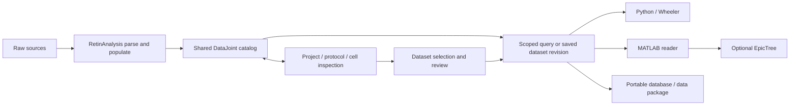

# Reuse RetinAnalysis as the shared DataJoint handoff

Date: 2026-09-27. Status: evidence and design draft; no database migration or application implementation.

## Scientist's direction

The project has an underlying database, with protocol coverage and distinct cells visible in the app. A recorded cell's data remains linked across protocols. Parsing/mapping populates a DataJoint-defined SQL schema. The app, MATLAB and Wheeler read the structured data from that handoff. A tree is an optional grouping built from query results. Protocol-specific curated datasets can be exported as separate databases for downstream work.

RetinAnalysis's existing schema, query and H5-access infrastructure is the starting point. The user selected the newer DataJoint stack already used there. The work is to connect existing components and fill specific gaps. The conceptual entities in the earlier design are responsibilities to account for, not a requirement to create a replacement table for every noun.

The web app linked by the scientist, SamarjitK/datajoint, supplies the initial user-facing functionality: queries, tree navigation, metadata/device inspection, tags and export. Bring these into one local workspace with automatic parse jobs and activity history. Do not require daily manual startup of separate services or manual switching between scripts.

## Existing infrastructure to reuse

| Need | Existing evidence | Integration work |
|---|---|---|
| Acquisition schema | [RetinAnalysis schema](/Users/maxwellsdm/Documents/GitHub/retinanalysis/src/retinanalysis/config/schema.py:41): Protocol, Experiment, Animal, Preparation, Cell, EpochGroup, EpochBlock, Epoch, Response, Stimulus, Tags; MEA sorting tables | Establish this as the schema authority and reconcile useful additions from the separate web app. |
| Offline-safe package imports | [Lazy schema accessor](/Users/maxwellsdm/Documents/GitHub/retinanalysis/src/retinanalysis/_database.py:1) defers schema import until database access | Preserve this separation; it is connection laziness, not a waveform cache or lazy tree. |
| H5 parsing | `Symphony2Reader` / `h5_to_datajoint_json` in `utils/parse_data.py` | Wrap parse and populate in an observable job; replace the population placeholder rather than add another parser. |
| Population entry point | [populate_database](/Users/maxwellsdm/Documents/GitHub/retinanalysis/src/retinanalysis/utils/database_utils.py:6) and `database_pop.py` | Explicit source/version/status and retry policy; missing JSON is currently skipped. |
| Experiment/protocol overview | [get_exp_summary](/Users/maxwellsdm/Documents/GitHub/retinanalysis/src/retinanalysis/utils/datajoint_utils.py:170) joins groups, cells, preparation, blocks and protocols | Extend into bounded project/protocol coverage queries with distinct-cell counts. |
| Protocol discovery | [search_protocol](/Users/maxwellsdm/Documents/GitHub/retinanalysis/src/retinanalysis/utils/datajoint_utils.py:354), [get_datasets_from_protocol_names](/Users/maxwellsdm/Documents/GitHub/retinanalysis/src/retinanalysis/utils/datajoint_utils.py:378) | Reuse predicates, but inspect single-cell versus MEA assumptions before exposing generic UI queries. |
| Epoch metadata and split dimensions | [get_epoch_data_from_exp](/Users/maxwellsdm/Documents/GitHub/retinanalysis/src/retinanalysis/utils/datajoint_utils.py:936), [find_varying_epoch_parameters](/Users/maxwellsdm/Documents/GitHub/retinanalysis/src/retinanalysis/utils/datajoint_utils.py:899) | Stable source/cell IDs, paged reads and a field registry; current helper materializes a block dataframe. |
| Block/response access | `get_epochblock_query`, `get_epochblock_response_query`, `get_epochblock_amp_data` | Add a per-epoch/per-stream window contract and bounded caches without duplicating H5 decoding. |
| Stimulus/analysis operations | `StimBlock`, `SCResponseBlock`, protocol-specific pipeline classes | Run as optional adapters/jobs with declared inputs and outputs. |
| Tree grouping and visual inclusion | EpicTree's splitters, `epicTreeTools`, `epicTreeGUI` | Adapt query output to epochs, preserve UUIDs, and make inclusion updates independent of graphical copies. |
| Export bridge | EpicTree Python MAT exporter; RetinaSRM compact/VMN SQLite builders | Version and validate profiles; remove mandatory intermediate files from the integrated path. |

## Newly verified divergence between repositories

Direct static comparison of both schema declarations found the same 15 table class names but differences in types and stimulus fields. No schema module was imported or activated for this comparison.

| Area | RetinAnalysis | Separate DataJoint web app | Consequence |
|---|---|---|---|
| Python DataJoint dependency | `datajoint==2.2.2` | `^0.14.1` | Do not assume their query/fetch/configuration APIs are interchangeable. |
| Schema activation | `dj.Schema` | `dj.schema` | Keep activation behind the selected backend adapter. |
| Fetch usage | `to_arrays`, `to_pandas`, `fetch1` | Older `fetch(as_dict=True)` patterns | Frontend routes need adaptation against the chosen version. |
| Time fields | `datetime` | `timestamp` | Validate date/time semantics in adapters and exports. |
| MEA and some integer fields | `bool`, `int32` | `tinyint unsigned`, `int` | Reconcile schema definitions rather than copy declarations blindly. |
| Stimulus | UUID, epoch parent, device, H5 path | Also generator ID, sample rate/units, duration and units | Preserve useful metadata for reconstruction; neither inspected declaration contains a complete generator-parameter/version contract. |

Sources: [RetinAnalysis dependency](/Users/maxwellsdm/Documents/GitHub/retinanalysis/pyproject.toml:40), [RetinAnalysis stimulus](/Users/maxwellsdm/Documents/GitHub/retinanalysis/src/retinanalysis/config/schema.py:280), [web schema](/Users/maxwellsdm/Documents/GitHub/datajoint/next-app/api/schema.py:13), [web dependencies](/Users/maxwellsdm/Documents/GitHub/datajoint/pyproject.toml:10).

RetinAnalysis's [June 2026 migration note](/Users/maxwellsdm/Documents/GitHub/retinanalysis/README.md:186) tells existing users to use a fresh database and repopulate after updating, rather than update a 0.14 database in place. This audit is not performing that migration. Live database version/state was not checked. Current [DataJoint version documentation](https://docs.datajoint.com/about/versioning/) also distinguishes 2.x from the legacy API family.

## Protocol and cell relationships are already represented

For single-cell data, the existing path is Cell ← EpochGroup ← EpochBlock → Protocol. Reuse that path to obtain all protocols recorded from the same cell. Preserve Experiment/Preparation context and full source IDs.

RetinAnalysis explicitly warns to use **EpochBlock.protocol_id** for protocol queries because EpochGroup can carry `no_group_protocol`. See [the existing query note](/Users/maxwellsdm/Documents/GitHub/retinanalysis/src/retinanalysis/utils/datajoint_utils.py:418). Protocol coverage must follow that rule, while keeping group labels as metadata.

The existing protocol-search helper also joins `SortingChunk` unconditionally at [line 448](/Users/maxwellsdm/Documents/GitHub/retinanalysis/src/retinanalysis/utils/datajoint_utils.py:448). That is a static indication of MEA-specific assumptions: it should not be used unchanged as the generic single-cell coverage query, where `chunk_id` can be null. The experiment-summary helper already branches on `is_mea`, offering a better pattern to reuse.

Project counts count distinct source-identified recorded cells once; per-protocol cell counts can overlap. Linking the same biological cell across separate sessions requires additional evidence. Never infer that link from `Cell2` alone. MEA `SortedCell` identity has different sorting/chunk semantics and needs its own mapping; do not equate it directly with the single-cell `Cell` table.

### Readable cell labels and stable UUIDs

Latest scientist decision: cell cards show **recording date + original cell name/number**, with a visible **cell-type tag**. For example, `2026-09-25 · Cell 1` with `ON sustained` is an illustrative display label. UUIDs remain available under identifiers/provenance rather than dominating the UI. Use acquisition date, not import date; retain the source timezone or flag it as unknown. Where date and number collide across rigs or sessions, append the recording/session label visibly.

Each recorded cell and each acquisition epoch/trial has a stable internal UUID. Preserve existing source `h5_uuid` or Ovation `epoch_uid` verbatim as namespace-qualified mappings. Existing auto-increment DataJoint primary keys can remain for local joins: the stable UUID can be introduced through a mapping relation and exposed by handoff projections. Do not destructively replace keys merely to change display labels.

Allocate/map an internal identity once and reuse it on reimport. Cell type, mutable display name, file location, project membership and tree position must not participate in UUID construction. Reclassifying a cell updates its annotation history; it does not create a different cell or break figure/dataset links. The same trial appearing in several protocol workspaces retains one identity. Source-content and parse revisions describe versions of that identity. If correspondence cannot be established after a source change, retain unresolved mapping rather than merge by date/name.

An analysis segment extracted within an epoch has its own derived identity plus parent epoch UUID and sample interval. Do not equate a segment index, stream, or trial position in a tree with a new acquisition epoch. Distinct same-cell observations across sessions remain unmerged until an explicit identity link is supported.

## Minimal additions around the existing schema

### H5 selection and source pointers

The scientist's intended import is a file picker (or drop) for one H5 recording in the current project. The backend runs the existing RetinAnalysis parser and population logic. Its intermediate JSON is an internal job artifact; the scientist should not generate or select it separately. Parsing must precede population: the current population path does not supply that complete orchestration.

The pointer infrastructure already exists: `Experiment.data_file` identifies the recording file; `Response.h5path` and `Stimulus.h5path` locate streams; acquisition objects retain `h5_uuid`. Reuse those fields and readers. A pathname is a locator, not a durable identity, and the existing auto-increment row IDs must not be the external handoff identity.

Proposed small extension, with final table names/DDL deferred:

| Responsibility | Proposed information / rule |
|---|---|
| Project membership | Explicit project ID linked to the imported experiment; separate from its optional free-text project label. |
| Source asset and version | Stable asset ID, content fingerprint, size and source UUID namespace. Record finalized source versions; a changed file cannot silently stand for an earlier version. |
| Source location | Asset version → local path or mounted-storage locator; relocation updates the locator after verification, preserving identity and curation. Start with references in place; managed copying can be an explicit storage option. |
| Import run | Source version, project, actor, start/end times, parser/mapping versions, status, warnings, counts of added/matched/skipped entities and error details. |
| Stream pointer | Source version + H5 dataset path + device identity; retain existing epoch/response links, sample rate, units and timing. Resolve the file server-side and read only the requested sample range. |
| Metadata provenance | Retain original properties/attributes and distinguish inherited block fields from epoch overrides and later annotations. Preserve effective parameters without losing where they came from. |

Queue → identify source → parse → validate → populate → ready for inspection. Show counts and job state immediately; publish catalog visibility only when the import is complete. Retries must not duplicate acquisition rows. A quick path/size/time check can detect candidate repeats, but final deduplication must verify identity/content; checking the whole H5 file should happen in a worker, not block the UI thread. An actively changing acquisition file needs a stable snapshot or a waiting state.

For unchanged input, reopen the existing recording and report “already imported.” Refresh presets against new catalog entries without re-parsing old sources. For changed input or parser versions, record a new run/version and retain earlier dataset provenance. Do not use `reload_experiment_data` as the normal update operation: its present implementation deletes the experiment before population.

If a referenced file goes offline, keep metadata, tags and import history browseable and show a source-unavailable state on traces. Offer relinking to a verified source; never resolve by basename alone. Reference-only exports depend on those sources being accessible. A self-contained export must bundle the required data and remap its references.

| Addition | Why the current model needs it | Start small |
|---|---|---|
| Explicit project scope | Project is currently only an optional Experiment string | A project record and explicit recording membership; physical database-per-project remains a deployment choice. |
| Source/import version record | Metadata files and row IDs do not identify parser/mapping versions or support replay | Asset fingerprint/version plus parser/mapping run, status and warnings; keep existing acquisition IDs with external stable mappings. |
| Dataset + immutable revision membership | Query state and tags do not describe one reproducible curated collection | Saved query/policy, exact epoch/source membership and publication metadata. |
| Scoped inclusion/review decisions | Current user tags and UGM masks lack dataset revision/reason semantics | Associate decisions with a dataset draft and stable epoch ID; keep reviewed state separate from inclusion. |
| Stream/reconstruction contract | String metadata and H5 references are inconsistent across copies | Reconcile device, units, sample rate/count, per-stream source locator, generator parameters/version. |
| Saved split view | Grouping recipes live in MATLAB scripts | Persist ordered split fields/function versions independently of membership. |
| Operation history and corrections | File timestamps and user tags do not capture who changed what, when or why | Database-backed operation/event records with target UUIDs, before/after values, counts, lifecycle and output links; editable notes/corrections retain prior versions. |

Reuse existing acquisition relations for scientific facts. Prefer explicit query projections/read models over duplicating the schema into a second custom database. Do not turn every design concept into a new table before checking whether a relation, part table, index, or adapter suffices.

Human/external input and selection records can remain `Manual`. Imported/computed tables may wrap versioned parse/analysis requests where useful. Keys and dependency semantics determine correctness; merely changing a table tier does not supply provenance or automatic invalidation. [DataJoint computation documentation](https://docs.datajoint.com/tutorials/basics/05-computation/).

## MATLAB and optional EpicTree

A proposed small MATLAB reader takes a live query/dataset revision or a portable export and returns:

- Dataset identity, source versions, membership policy and limitations.
- Epoch metadata with stable cell/epoch identities, protocol fields, parameters and timing.
- Per-stream references and a windowed read operation, retaining raw values, units and exact sample coordinates.
- Optional conversion to the epoch representation expected by `epicTreeTools`.

Then the user can use arrays/tables directly, or build a tree from those epochs and a chosen split recipe. Regrouping the tree never changes the dataset membership by itself.

The existing MAT exporter is a usable first compatibility bridge. A later reader can remove that file round-trip. The adapter must preserve per-response H5 locations; an explicit root file override must not send all epochs to the first experiment's file.

Do not promise that the legacy MATLAB DataJoint client works unchanged with RetinAnalysis 2.2.2. The official MATLAB repository is now in [community-stewardship mode](https://github.com/datajoint/datajoint-matlab). Validate direct-client compatibility; a thin reader over the Python service, documented SQL views, or a portable format remains an option. No MATLAB reader has been implemented or runtime-tested in this design task.

## Handoff contract and performance

Use the same query/membership rules for the app, Python/Wheeler and MATLAB. Database consumers need no tree. Portable SQLite/MAT exports remain explicit profiles, not alternate sources of silently mutable truth.

Project/protocol overviews query metadata, not raw samples. Tree expansion returns one page of groups; arbitrary splitter functions become cached versioned derived fields. Trace reads request a particular epoch/device/window. Raw caches are keyed by source/epoch/device/window; aggregate caches also include dataset revision and alignment policy. A changed tree layout never forces re-parsing raw files.

See [integration contracts](/Users/maxwellsdm/Documents/GitHub/epicTreeGUI/docs/dev/INTEGRATION_CONTRACTS_DRAFT.md) for boundary fields, validation scenarios and publication behavior.

## Next design-validation slice

Use one real recorded cell with noise and receptive-field protocols and verifiable source identity. Query both through RetinAnalysis, show protocol coverage, inspect either recording, define a noise-only dataset, and compare Python/MATLAB/export membership and sampled waveform values. Build an EpicTree from the same selection as an optional final check.

This is a proposed future validation. The first steps are selecting the source and finalizing the reader/profile contract, not migrating or rebuilding the existing SRM and VMN research databases.
