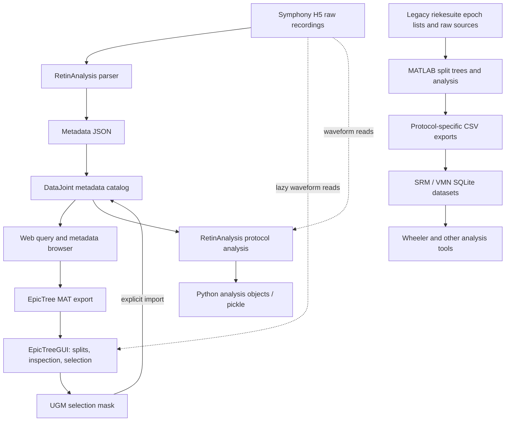

# Unified data workspace: workflow audit and design draft

Date: 2026-09-27. Status: completed workflow audit and integration design, incorporating the scientist's UI feedback. Proposed behavior is not implemented or scientifically validated. Start with [the design handoff](DESIGN_HANDOFF.md).

## Goal and user decisions

Map the complete workflow, design its integration and natural handoff points, and then work through the UI with the scientist. The desired app has a Slack-like arrangement of project navigation, sidebars, and project overviews across experimental protocols. Responsiveness and lazy loading are core requirements. People must be able to use individual stages with their own tools; Wheeler is an optional consumer.

The initial ambiguous phrase “scale overview” was clarified as an overview of the whole project and its different protocols. No separate multiscale requirement is assumed.

The scientist subsequently clarified the intended sequence: import → map/parse into a schema → visually inspect and select → export → use the export as a database, optionally building a tree for further exploration. The tree is a central inspection interaction. It must not be a compulsory reconstruction step for downstream database consumers.

Further clarification: the project owns an underlying catalog/database and presents distinct cell counts plus protocol coverage. Protocol is the primary navigation split within a project. The same recorded cell can participate in multiple protocols: while inspecting its noise recording, the user may need to inspect its receptive-field measurement. These records must remain linked. Protocol-specific curated exports can become separate downstream databases without losing the shared cell/source identities. The split tree stays available for verifying and changing grouping; its necessity and default placement should be tested in the UI walkthrough.

The scientist has selected the newer DataJoint direction and identified RetinAnalysis's existing infrastructure as the starting point. Its current checkout pins DataJoint 2.2.2; the separate web app pins 0.14.x. Reconcile the existing schemas and adapters rather than create another independent schema copy. See [DataJoint reuse and handoff design](/Users/maxwellsdm/Documents/GitHub/epicTreeGUI/docs/dev/DATAJOINT_HANDOFF_SCHEMA_DRAFT.md).

Primary experience: open the local app → drop a recording or point to its location → automatic parse/map with progress → inspect individual epochs → tag/select/mask → export a protocol dataset or update an existing dataset. Import, parsing, mask changes, database updates and exports need a persistent activity history with relevant metadata. The UI must eliminate the need to open scripts manually for routine ingestion and inspection. The scientist clarified that “cropping” meant tagging and the existing web-app tools; time trimming is not a requested requirement.

The scientist identified [SamarjitK/datajoint](https://github.com/SamarjitK/datajoint) as the web-app functionality baseline. Its README, existing dashboard/download screenshots, and local frontend/backend source were inspected. The app was not running on its documented frontend port during the audit; screenshots show its documented interface, not a live database session. Preserve nested queries, metadata inspection, tree multi-selection, tags, device visualizations and export options while integrating automatic parsing and the project/protocol overview. Local additions include EpicTree MAT export and UGM import. Keep daily operation in one launcher; project settings and data paths persist. Backend packaging is setup work, not a recurring user task.

## Confirming the visual-selection stage

UI terminology refinement: user-defined protocol workspaces organize saved queries, protocol datasets and figures. Initial examples are variable-mean noise current injection (VMN) and current injection across frequency cutoffs. These workspaces are distinct from the acquisition system's protocol class names. Receptive-field information can be a linked cell measurement/figure; it should not automatically become its own protocol navigation item. Project overview needs visual widgets for cell totals, protocol coverage, review state, linked figures and import activity. The import timeline must show what source arrived, when, who imported it, and counts of new versus already-known cells/recordings.

Frontend direction confirmed: a React application, reusing the existing Next.js/React web-app components and logic. The HTML conversation sketch is a design prototype only. The intended product is a local app experience with one launch point, managed backend processes, persistent project state and a React interface. Desktop-shell packaging versus a locally served app is a deployment decision; neither requires rewriting the existing scientific backend. Use Slack's workspace/sidebar/content arrangement as a navigation reference, adapted to scientific workspaces rather than messaging channels.

Latest bookkeeping requirement: reuse named query presets across new imports; automatically discover new matching records, avoid re-parsing unchanged data, and retain a queue of unreviewed/approval-needed cells or recordings. The web app already has query-object save/load support. Extend it with project scope, evaluation history and review state. A final curated dataset can stay in DataJoint and be queried directly; portable export and EpicTree remain optional. The main work is orchestration and visual experience around existing validated scientific logic.

There are three distinct implementations, with different roles:

| Component | Verified caller and behavior | Integration point |
|---|---|---|
| DataJoint `ResultsViewer` / `ResultsTree` / `Information` | Web query results become a hierarchical browser; checkbox selection feeds tagging actions, and focus fetches metadata and a device trace image. Export operates on the backend query, not directly on the frontend checkbox list. | Shared query and curation service; explicitly translate tagged/selected membership into the dataset being exported. |
| `epicTreeGUI` | Constructor requires a prebuilt `epicTreeTools` tree. It combines tree navigation, raw response inspection, epoch inclusion, UGM saving and a separate selection export. | Reuse its selection/splitting behavior in the inspection stage; remove the required MAT handoff from the integrated path while preserving MAT compatibility. |
| Legacy `epochTreeGUI` | Both RetinaSRM population scripts call `riekesuite.analysis.buildTree`, then `epochTreeGUI(tree)`, then `getSelectedEpochTreeNodes(gui)`. Their export scripts traverse the chosen subtree. | Adapter for legacy tree/epoch sources and current exports; preserve source epoch identities and make export policy explicit. |

Thus the proposed five-stage user workflow is appropriate, but today's code includes intermediate format exports and builds trees before visual selection as well. The integrated app can hide the intermediate transport steps while keeping the scientific stages visible.

The compact SRM export also chooses the SD group with the most epochs within each frequency. This is a scripted membership rule in addition to visual subtree selection. The new export preview should expose such policies and show resulting counts; it must not imply that every visible trial was exported.

Direct evidence: [legacy SRM GUI caller](/Users/maxwellsdm/Documents/GitHub/matlabPyrTools/retinaSRM/curreinjt_ai_population.m:60), [VMN GUI caller](/Users/maxwellsdm/Documents/GitHub/matlabPyrTools/retinaSRM/curreinjt_diff_mean_population.m:59), [SRM export selection policy](/Users/maxwellsdm/Documents/GitHub/matlabPyrTools/retinaSRM/export_to_kosmos.m:81), [web checkbox/tag handling](/Users/maxwellsdm/Documents/GitHub/datajoint/next-app/src/app/components/results/ResultsTree.js:91), [web trace inspector](/Users/maxwellsdm/Documents/GitHub/datajoint/next-app/src/app/components/results/Information.js:20), [EpicTree constructor](/Users/maxwellsdm/Documents/GitHub/epicTreeGUI/epicTreeGUI.m:53).

## Evidence and limits

A delegated audit inventoried EpicTreeGUI source modules, examples, tests and documentation, and traced its principal execution paths plus relevant RetinAnalysis code. The primary audit inspected the sibling DataJoint backend, schema and frontend, and the actual RetinaSRM exports and builders identified by the user.

Inspection was static except for read-only SQLite schema and small-table queries. No MATLAB execution, end-to-end ingestion, database migration, scientific recomputation, or performance benchmark was performed. Documentation was checked against code where possible; historical success reports are not current verification.

Wheeler's health check could not connect to its configured local Neo4j endpoint. Graph provenance was therefore not verified live. Local source and SQLite evidence below do not depend on a successful graph lookup. Existing database files and research artifacts were not edited.

## Current workflow: parallel routes



There is no evidence that today's SRM/VMN SQLite handoff is produced by EpicTreeGUI. RetinAnalysis is both an upstream parser and a parallel analysis library, rather than one mandatory downstream stage.

| Responsibility | Current implementation | Boundary or limitation |
|---|---|---|
| H5 parsing | RetinAnalysis `Symphony2Reader`, `h5_to_datajoint_json` | Separate parser invocation produces metadata JSON; population does not automatically complete this step. |
| Metadata indexing | DataJoint `schema.py`, `helpers/pop.py`; RetinAnalysis has another population implementation | Both inspected population paths retain an H5 parsing placeholder and skip H5 without metadata JSON. |
| Query and overview | DataJoint Flask/Next.js app | Setup wizard and fixed acquisition tree; project is a nullable experiment string, not a first-class workspace. |
| Tree exploration | EpicTreeGUI `epicTreeTools` | Takes exported MAT data and a prebuilt tree; grouping can use fields or arbitrary MATLAB functions. |
| Epoch curation | In-memory flags, UUID-keyed UGM, user-specific DataJoint tags | Separate representations; no named dataset revision or decision history spanning all stages. |
| Analysis | MATLAB library and RetinAnalysis protocol classes | Different capabilities and serialization; preserve both as adapters initially. |
| Clean research datasets | RetinaSRM MATLAB scripts, CSV builders, SQLite | Useful existing handoff, with protocol-specific schema extensions and historical repairs. |

## What the current schemas actually contain

### DataJoint metadata catalog

The inspected schema models Experiment → Animal → Preparation → Cell → EpochGroup → EpochBlock → Epoch, with response/stimulus children, protocol names, tags, and MEA sorting tables. All declared tables use `dj.Manual`. Acquisition metadata appears in typed columns plus `properties`, `attributes`, and parameter JSON.

Rows primarily use auto-increment IDs. `h5_uuid` is a secondary string without an explicit uniqueness declaration in the inspected schema. Project is a string on Experiment. Tags hold an object UUID, table/row identity, user and tag; there is no dataset-specific selection revision.

The web query builder stores condition strings in a nested AND/OR/NOT structure, traverses a fixed hierarchy to responses, and recursively fetches a complete result tree. Query, database and user state are module globals. Independent comparison panes and concurrent users will require explicit request/workspace/query context.

### Existing portable datasets

Read-only inspection of the live files on 2026-09-27 found:

| Dataset | Small-table counts | Trace representation | Identity and evolution |
|---|---|---|---|
| `retina_srm_compact.db` | 108 conditions; 13 distinct `unique_cell_id` values in the base conditions table | Rows contain condition, trial, time, raw voltage, cleaned voltage, injected current | No core `epochs` table; conditions now include canonical/remediation fields and corrected identity fields. Additional result tables exist beyond the original builder. |
| `vmn_diff_mean.db` | 168 conditions; 13 distinct `unique_cell_id` values | Rows contain condition, trial, voltage; ordering depends on rowid | `epochs` carries full `epoch_uid`, timing, stimulus recipes and added measurements; `epoch_keys` provides a cross-cell-safe key. |

These are counts of stored identifiers, not a claim that there are 26 distinct biological cells across the two datasets. The compact database's canonical view must be considered when presenting scientific counts.

`EXPORT_CONTRACT.md` already defines independently usable completeness levels: raw data, elementary analysis, and SRM fits. Preserve this useful concept. VMN's builder explicitly departs from the original six-column trace contract and introduces mean, duration, seed mode and epoch identity. The original builders alone do not recreate all present-day extensions.

The original compact export documentation reports filename collisions across sessions. The current schema contains remediation and canonical views. Treat legacy identity as a migration concern, not a reason to silently relabel or regenerate data. VMN's full Ovation `epoch_uid` and Symphony `h5_uuid` belong to different identifier systems; do not assume they are interchangeable.

## Integration proposal

Provide one workspace over a shared metadata, query, curation and trace-access interface, with adapters for existing source systems. A user may enter or leave at each stage. Keep raw assets immutable and keep analysis products separate from raw acquisition metadata.

### Proposed conceptual entities

| Entity | Purpose |
|---|---|
| Project / project membership | Research scope spanning recordings, protocols, datasets and analyses; membership need not require copying recordings. |
| Source asset / location | Stable raw source identity, fingerprint, format and resolvable locations, independent of machine-specific path. |
| Import run | Parser identity/version, source revision, warnings, failures and normalized metadata output. |
| Acquisition entities | Preserve source experiment/animal/preparation/cell/group/block/epoch relationships and source identifiers. |
| Cell–protocol participation | Connect each recorded cell to all its protocol recordings, supporting cross-protocol navigation and coverage counts without duplicating the cell. |
| Identity mapping | Namespace-qualified source IDs mapped to internal identities; explicitly represent unresolved legacy mappings. |
| Protocol definition / parameters | Preserve original parameter names, typed values, units, scope and overrides; add indexed projections for commonly queried dimensions. |
| Stream / stimulus recipe | Device, sample rate, units, length, storage reference, and stimulus generator/version/seed/parameters. |
| Dataset definition / revision | A saved query and inclusion policy; a frozen revision records exact epoch membership and input revisions. |
| Curation decision | Inclusion state, reason, author and scope within a dataset revision; distinguish it from display focus. |
| Saved view | Ordered split dimensions, filter state, open panes and display settings. |
| Analysis run / artifact | Exact inputs, algorithm and code version, parameters, completion state and outputs. |

Preserve unmodified source metadata alongside typed query fields. Avoid a giant table for every possible protocol parameter and avoid requiring arbitrary JSON scans for every common filter. Start with the SRM and VMN dimensions as concrete examples, then validate on a spatial protocol.

The newer DataJoint stack used by RetinAnalysis is the selected integration direction. Its existing acquisition model is the baseline. Imported/computed stages may wrap versioned parsing and analysis where appropriate; changing table tiers alone will not unify the workflow. The separate web app's older 0.14.x API and extra stimulus fields are compatibility work to account for. Existing database state is unverified; no migration or repopulation is authorized as part of this design task. Reference: [DataJoint computation documentation](https://docs.datajoint.com/tutorials/basics/05-computation/).

### Context from DataJoint's website

The scientist supplied [datajoint.com](https://datajoint.com/) during the audit. Its platform framing connects experiments, computations and results, and its [ecosystem overview](https://datajoint.com/ecosystem/) emphasizes integration with existing tools. That supports the proposed independently usable stages.

The technical [pipeline documentation](https://docs.datajoint.com/python-0.x/latest/concepts/data-pipelines/) describes a dependency graph of tables with manual, imported and computed data, accessed from MATLAB and Python. In our design, that graph could express processing dependencies while the user-facing split tree remains a freely changeable grouping of recordings. These are different trees/graphs serving different purposes.

The [bulk-storage documentation](https://docs.datajoint.com/python-0.x/latest/sysadmin/bulk-storage/) supports separating queryable relational metadata from large externally stored data and discusses caching and network round trips. This supports a metadata-first overview with a separate windowed waveform reader. It does not establish that an arbitrary external blob supports partial reads; that must be verified in the chosen storage adapter.

The [0.x query-cache documentation](https://docs.datajoint.com/python-0.x/latest/query/query-caching/) explicitly disables inserts, deletes and transactions while that cache is enabled. It is therefore not a drop-in solution for the app's editable curation sessions. Use deliberate read-cache lifetimes and revision keys, with writes routed through uncached operations.

Treat broad claims on the [current platform page](https://datajoint.com/platform/) as product context, not proof that every feature is present in this checkout. In particular, core 0.x `populate()` fills missing keys; changing source code or an input value does not by itself guarantee versioned automatic recomputation. Explicit input/code versions, scheduling and invalidation remain part of this integration design.

The 0.x links above describe the older web app's context, not the chosen new backend. RetinAnalysis's current 2.2.2 dependency and source usage were subsequently verified. MATLAB-reader compatibility must be tested against that target; the official MATLAB client is now community-maintained.

### Natural handoff points

| Boundary | Independently useful output | Entry/exit behavior |
|---|---|---|
| Parsed recording | Versioned metadata manifest and raw-stream references | Use our parser without our app/database; bring equivalent metadata from another parser. |
| Curated dataset | Exact membership, inclusion decisions, source identities, data dictionary and source references or bundled data | Use the app only for selection; query/export without adopting its analyses. |
| Analysis | Input revision plus parameters, results and artifact manifest | Run existing MATLAB, Python or third-party tools; register returned outputs against the same inputs. |
| Research handoff | Portable SQLite profile or tables/arrays plus manifest and reader examples | Wheeler, Kosmos, notebooks and scripts consume it without requiring the UI or a live DataJoint server. |

For every package, declare format/profile version, stable IDs, sample ordering, units, timing, completeness, transformations, code/parser versions and whether waveforms are included or referenced. A reference-only package is not self-contained unless its external assets remain available. Offer an explicit bundle option.

Keep SQLite compatibility exports for today's consumers. Introduce explicit profiles for compact SRM and VMN rather than claiming that their current files share one exact schema. Export and import validation should report unsupported/missing fields rather than discard them. UI operations, scripts and Wheeler should share the same query/membership semantics.

## Responsiveness and lazy loading

### Current behavior

EpicTreeGUI defers H5 waveform reads until extraction, but loads MAT metadata and flattens all epochs in memory. Split construction builds the tree recursively; the main GUI constructs graphical nodes recursively. The custom tree reuses widgets for expanded nodes, which is useful, but is not full viewport virtualization or backend branch pagination.

Ordinary group focus displays a first epoch. Explicit aggregate extraction builds a dense matrix of every selected epoch and reads whole traces synchronously. The H5 reader has no evident persistent waveform cache. Repeated calls may reread files. Mixed trace lengths are rejected and the matrix path takes the first response's sample rate. This is not a sufficient read contract for arbitrary project-wide aggregation.

The DataJoint result builder recursively fetches the hierarchy before returning it. Its trace endpoint renders a complete waveform to PNG on the server. The SQLite sample tables are large; the project overview should query metadata rather than scan sample rows.

### Proposed loading behavior

1. **Project overview:** fetch protocol/recording counts and readiness summaries from indexed metadata or revisioned summaries. No raw waveform I/O on opening a project.
2. **Tree and tables:** fetch one branch/page at a time; render visible rows only. Splits are saved query/grouping definitions. Built-in field splits can execute near the catalog; custom MATLAB functions require an explicit computed-field job, with version and pending status.
3. **Raw inspection:** fetch the focused stream and requested sample/time window, retain full recorded sample rate and voltage values, and reuse plot buffers. Full-epoch loading remains available. Prefetch adjacent epochs only within a bounded budget.
4. **Caches:** use byte-bounded waveform and stimulus caches keyed by source revision, full epoch identity, device, sample interval, and transform/generator version. Cache grouping summaries by dataset revision, filters and split recipe. Never key by a short `pNNN` name or display label.
5. **Fast interaction:** debounce navigation, coalesce duplicate reads, cancel obsolete requests and suppress stale responses. A delayed response for a previous epoch must never replace the current trace. Split panes share immutable cached data but keep their focus independent.
6. **Group summaries:** calculate exact summaries in chunks or background jobs, with inclusion revision and alignment policy in the cache key. Do not trigger a whole-project average just by expanding a tree node. Explicitly account for mixed units, sample rates, lengths and stimulus timing.
7. **Background work:** parsing, indexing, stimulus reconstruction, spike detection and export expose progress, retry/cancellation and partial-failure state. Completed data remains browsable while another protocol is being processed.
8. **Storage adapters:** use bounded H5 reads where supported. For existing VMN SQLite, preserve `ORDER BY rowid` and use existing epoch bounds/indexes. A future array-oriented representation can accelerate access without forcing a rewrite of legacy SQLite packages. New formats should carry explicit sample ordering rather than relying on incidental insertion order.

The RetinaSRM project explicitly prefers full-rate raw/model trace overlays without display smoothing. The baseline design respects that. Any reduced overview representation must be an explicitly labeled summary and cannot silently replace raw samples or feed analysis.

### Proposed validation targets, not measured claims

- Project overview opens without waveform reads and without transferring all epochs.
- Tree expansion has bounded queries, payload and visible-row rendering cost.
- Reopening an unchanged trace avoids a second source read when cached.
- Changing inclusion invalidates affected aggregates but preserves raw trace caches.
- Large import/export/analysis jobs do not block navigation or other panes.
- Measure cold and warm p50/p95 latency, bytes read/transferred, memory, cache hit rate and cancellation behavior on local disk and NAS before choosing latency budgets.
- Confirm full-resolution sample equality and correct epoch identity alongside speed tests.

## Slack-like UI concept and walkthrough decisions

```text
Project rail | Project navigation       | Main workspace           | Context sidebar
-------------+--------------------------+--------------------------+-----------------
Project A    | Overview                 | Protocol coverage        | Focused entity
Project B    | Protocols                | Recordings / conditions  | Source metadata
             | Recordings               | Saved split tree + table | Inclusion + reason
             | Curated datasets         | Raw trace inspection     | Parse warnings
             | Analyses                 | Compare pane A / pane B  | Provenance
             | Imports and exports      | Job/result view          | Relevant actions
```

The project rail switches scientific contexts. The second sidebar exposes the project's user-defined protocol workspaces and saved work. The center changes between overview and exploration, with optional side-by-side comparison. The right sidebar can follow focus for provenance and relevant actions. Following the scientist's screenshot and feedback, core metadata is visible in the main view: a summary near the top of project home, a full metadata section below, and a field/value table beneath the epoch trace. It must not require opening the right sidebar. Comparison panes retain independent focus; linking their axes or filters is an explicit action.

The default project landing page should show distinct cells and per-protocol coverage, then parsing/review state and available datasets. Opening a protocol shows its cells and links to their related protocol recordings; raw inspection is the next level. Protocol cell counts may overlap and must not be summed to infer project cell count. Keep pipeline configuration in contextual actions rather than presenting a database setup wizard every session.

Cross-protocol navigation keeps the same cell identity pinned. For example: variable-mean-noise → Cell2 from a specified recording session → that cell's receptive-field data → return to the original noise selection. Preserve each view's focus, split recipe, time window and unsaved draft. Missing receptive-field data should be visible as missing, not confused with failed quality. When source identity cannot establish that two records are the same cell, show an unresolved link rather than join on Cell2 alone.

The interactive design walkthrough uses illustrative records: project overview → VMN or frequency-cutoff workspace → cell/epoch inspection → tags, inclusion and review → save a DataJoint dataset or choose an external handoff. It also shows saved queries, linked figures, import history and optional split grouping. Navigation grouping must not alter the acquisition hierarchy, and opening a trace must not change dataset membership. A later implementation validation must repeat this journey using actual recordings.

## Implementation risks to resolve before migration

- EpicTree's main checkbox callback directly assigns a private-set `custom` property and changes graphical epoch copies. Static concern: confirm/fix the selection-to-root path before trusting UI curation round-trips.
- The GUI's “Export Selection” produces `selectedEpochs`, while its loader requires `experiments` and `format_version`. These are different file contracts.
- MAT conversion and MATLAB flattening project away some parent metadata. Add explicit compatibility projections rather than treating the flattened view as the complete source record.
- Main GUI H5 selection can pick the first experiment's file and pass it as an override. Verify multi-experiment source resolution before offering project-wide trace browsing.
- The DataJoint MAT route passes hidden acquisition levels into an exporter that expects the full hierarchy. Presentation choices must not alter an export's structural contract.
- DB versions contain later additions not reproduced by original build scripts. Inventory schema migrations and compatibility readers before any rebuild.
- Stimulus recipes, nominal versus achieved stimulus values, epoch chronology and seed mode must survive all adapters. A grouping label alone is not a reliable scientific condition definition.

## Work after the design handoff

The companion contracts, schema reuse design, React plan and interactive sketch now cover items 1–3 of the original design work. The user's feedback established protocol workspace semantics, same-cell links, metadata placement, import simplicity, logging and React as the implementation direction. This is a design handoff, not approval of every visual detail.

When implementation is requested, start with one Symphony H5 → existing RetinAnalysis parser → project catalog → VMN inspection → saved preset/review → dataset revision. Validate real source identities and waveform equality, then repeat with another source to exercise duplicate detection and incremental discovery. Add portable readers/exports against both existing SQLite profiles and the EpicTree bridge. Benchmark cold/warm local and NAS access before claiming performance improvements. Choose desktop packaging and database deployment before distributing the app; these choices do not change the scientific handoff contracts.

## Code evidence index

- [DataJoint schema](/Users/maxwellsdm/Documents/GitHub/datajoint/next-app/api/schema.py:13)
- [DataJoint missing-parser branch](/Users/maxwellsdm/Documents/GitHub/datajoint/next-app/api/helpers/pop.py:407)
- [Query construction and recursive tree](/Users/maxwellsdm/Documents/GitHub/datajoint/next-app/api/helpers/query.py:128)
- [MAT export endpoint](/Users/maxwellsdm/Documents/GitHub/datajoint/next-app/api/app.py:393)
- [UGM tag import](/Users/maxwellsdm/Documents/GitHub/datajoint/next-app/api/helpers/query.py:473)
- [Existing setup UI](/Users/maxwellsdm/Documents/GitHub/datajoint/next-app/src/app/components/SetUpStepper.js:27)
- [Symphony parser](/Users/maxwellsdm/Documents/GitHub/retinanalysis/src/retinanalysis/utils/parse_data.py:1077)
- [Parser JSON entry point](/Users/maxwellsdm/Documents/GitHub/retinanalysis/src/retinanalysis/utils/parse_data.py:1943)
- [RetinAnalysis population placeholder](/Users/maxwellsdm/Documents/GitHub/retinanalysis/src/retinanalysis/utils/database_pop.py:698)
- [Protocol stimulus registry](/Users/maxwellsdm/Documents/GitHub/retinanalysis/src/retinanalysis/classes/stim.py:18)
- [Python response block](/Users/maxwellsdm/Documents/GitHub/retinanalysis/src/retinanalysis/classes/response.py:180)
- [EpicTree MAT exporter](/Users/maxwellsdm/Documents/GitHub/epicTreeGUI/python/export_mat.py:50)
- [MAT loader contract](/Users/maxwellsdm/Documents/GitHub/epicTreeGUI/src/loadEpicTreeData.m:43)
- [Epoch flattening](/Users/maxwellsdm/Documents/GitHub/epicTreeGUI/src/tree/epicTreeTools.m:2031)
- [GUI checkbox callback](/Users/maxwellsdm/Documents/GitHub/epicTreeGUI/epicTreeGUI.m:510)
- [GUI selection export](/Users/maxwellsdm/Documents/GitHub/epicTreeGUI/epicTreeGUI.m:563)
- [Whole-group extraction](/Users/maxwellsdm/Documents/GitHub/epicTreeGUI/src/tree/epicTreeTools.m:3927)
- [Lazy response read](/Users/maxwellsdm/Documents/GitHub/epicTreeGUI/src/tree/epicTreeTools.m:4008)
- [Tree widget pooling](/Users/maxwellsdm/Documents/GitHub/epicTreeGUI/src/gui/epicGraphicalTree.m:113)
- [Original SRM export workflow](/Users/maxwellsdm/Documents/GitHub/matlabPyrTools/retinaSRM/kosmos_export/README.md:42)
- [Existing export contract](/Users/maxwellsdm/Documents/GitHub/matlabPyrTools/retinaSRM/EXPORT_CONTRACT.md:1)
- [Compact SQLite builder](/Users/maxwellsdm/Documents/GitHub/matlabPyrTools/retinaSRM/kosmos_export/build_kosmos_db_compact.py:1)
- [VMN epoch export and condition identity](/Users/maxwellsdm/Documents/GitHub/matlabPyrTools/retinaSRM/curreinjt_diff_mean_population.m:180)
- [VMN database builder](/Users/maxwellsdm/Documents/GitHub/matlabPyrTools/retinaSRM/build_vmn_diff_mean_db.sh:1)
- [VMN reader/schema notes](/Users/maxwellsdm/Documents/GitHub/matlabPyrTools/retinaSRM/VMN_DB_BRIEFER.md:1)
